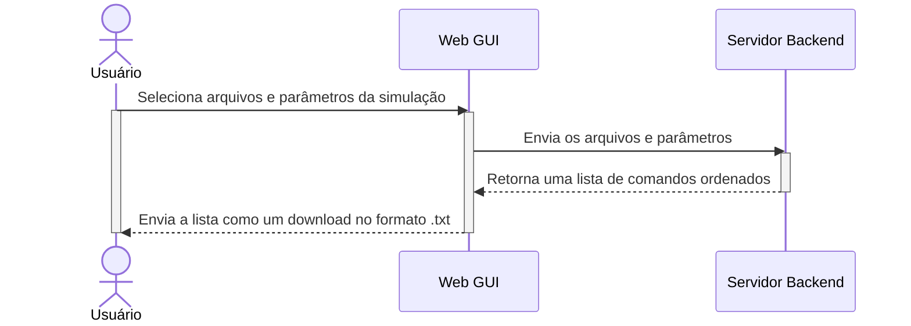
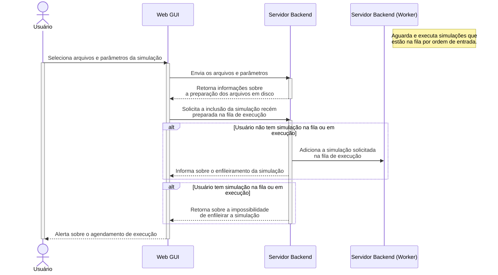

### Geração de comandos para Simulação

```mermaid
sequenceDiagram
  actor Usuário
  participant Web GUI
  participant Servidor Backend

  Usuário->>Web GUI: Seleciona arquivos e parâmetros da simulação
  activate Usuário
  activate Web GUI
  Web GUI->>Servidor Backend: Envia os arquivos e parâmetros
  activate Servidor Backend
  Servidor Backend-->>Web GUI: Retorna uma lista de comandos ordenados
  deactivate Servidor Backend
  Web GUI-->>Usuário: Envia a lista como um download no formato .txt
  deactivate Web GUI
  deactivate Usuário
```

---
layout: default
title: Geração e execução de comandos para Simulação
---

### Geração e execução de comandos para Simulação

```mermaid
sequenceDiagram
  actor Usuário
  participant Web GUI
  participant Servidor Backend
  participant Servidor Backend (Worker)
  Note right of Servidor Backend (Worker): Aguarda e executa simulações que<br/> estão na fila por ordem de entrada.

  Usuário->>Web GUI: Seleciona arquivos e parâmetros da simulação
  activate Usuário
  activate Web GUI
  Web GUI->>Servidor Backend: Envia os arquivos e parâmetros
  activate Servidor Backend
  Servidor Backend-->>Web GUI: Retorna informações sobre<br/> a preparação dos arquivos em disco
  deactivate Servidor Backend
  Web GUI->>Servidor Backend: Solicita a inclusão da simulação recém<br/> preparada na fila de execução
  activate Servidor Backend
  alt Usuário não tem simulação na fila ou em execução
    Servidor Backend->>Servidor Backend (Worker): Adiciona a simulação solicitada <br/>na fila de execução
    Servidor Backend-->>Web GUI: Informa sobre o enfileiramento da simulação
  end
  alt Usuário tem simulação na fila ou em execução
    Servidor Backend-->>Web GUI: Retorna sobre a impossibilidade<br/> de enfileirar a simulação
  end
  deactivate Servidor Backend
  Web GUI-->>Usuário: Alerta sobre o agendamento de execução
  deactivate Web GUI
  deactivate Usuário
```
